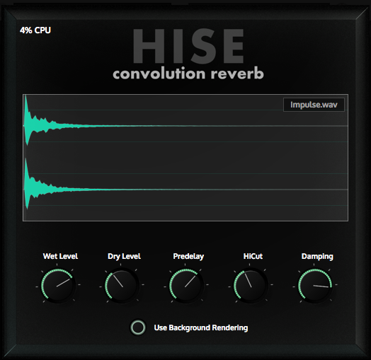
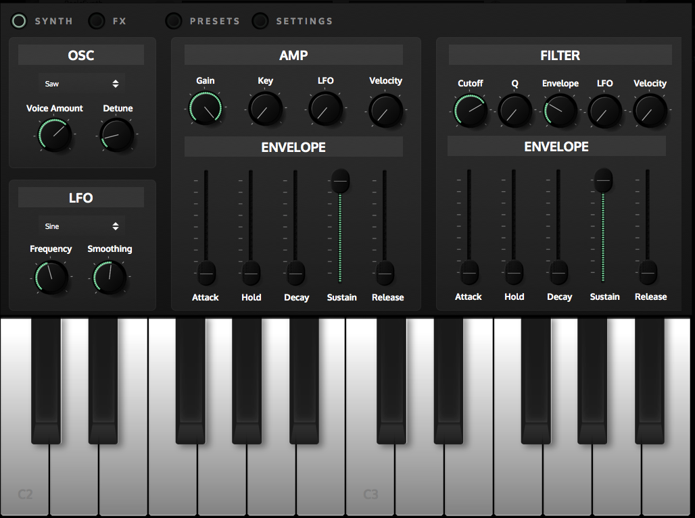
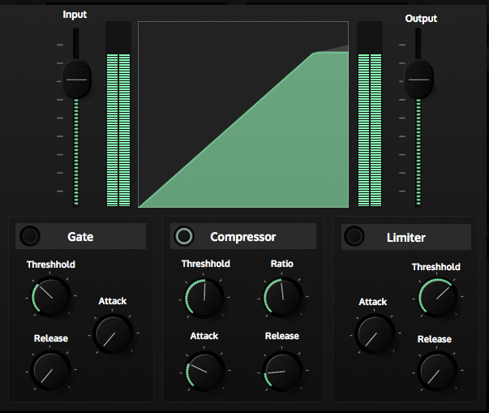
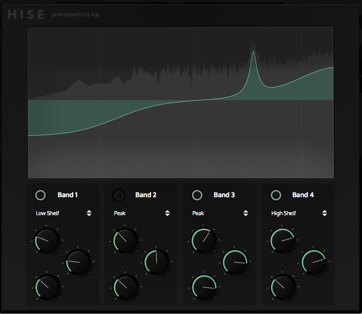

# HISE Tutorial repository

This is the repository for the example project (and a few other example projects) from the [HISE Tutorial](http://hise.audio/manual/Tutorial1.php). 
It contains the HISE project folder as well as a .gitignore file.

## How to open a project

1. Clone this repository
2. [Build the latest HISE version](https://github.com/christophhart/HISE/blob/master/README.md#how-to-compile-hise) (important, this repository might not be compatible with anything else than the latest tip)
3. Open HISE and load the project with **File->Load Project**. Select the project folder that you want to load:
4. Load the instrument from the XML file using the **File -> Open from XML** function.

These projects are supposed to be compilable on every platform / format so let me know if something breaks or doesn't work. If it doesn't work please make sure you are using the latest HISE version (and the latest source code).

## Included Projects

Apart from the Musicbox Tutorial, there are a few other example projects, which either demonstrate a few concepts (BasicSynth) or are useful tools on it's own (Convolution Reverb). They also act as CI tools, so whenever a new HISE version is built, it compiles every plugin to check if everything keeps working.

They also come precompiled with a standard installer for Windows / macOS, so feel free to download the plugins or load one of the project in HISE.

### Convolution Reverb

A convolution reverb using multithreaded background rendering of the IR and some basic controls.

### Basic Synth

A simple synthesiser using subtractive synthesis, a few modulators and an effect section. The UI is designed for both desktop as well as iPad usage.

### Dynamics FX

A compressor / limiter / gate that uses a custom component to render the dynamics curve.

### Parametric EQ

An equalizer using 4 full parametric bands and a FFT analyser that displays the frequency spectrum of the signal.